# Project Report

**Title:** Extending Connect: Multiclass Prediction of Acute Care Outcomes in Home Health Care

**Author:** Nav Sharma (fpd16)

**Professor** Dr. Jelena Tesic

---

## 1. Project Abstract

### Motivation

Home health care (HHC) agencies need reliable tools to identify patients at risk for acute care events before they occur. Existing machine learning models treat emergency department visits and inpatient hospitalizations as a single outcome, obscuring clinically distinct events with different drivers and intervention needs. An initial three-class framework (Stable / ED-Only / Hospitalized) revealed that 80% of ED visits resulted in inpatient admission, making the ED-only class too heterogeneous for effective prediction and motivating a reframe into two binary tasks. Using 15.7 million national CMS OASIS start-of-care assessments and ZIP-level social determinants of health (SDOH), we defined two binary prediction tasks: Task 1 predicts inpatient hospitalization versus remaining stable at home (N=5.49M), and Task 2 predicts hospital admission versus discharge among ED-presenting patients (N=926K). We applied LightGBM with Optuna hyperparameter tuning on feature-selected datasets of 310 and 330 features respectively. Task 1 achieves ROC-AUC of 0.8838 and Macro F1 of 0.7269; Task 2 achieves ROC-AUC of 0.7967 and Macro F1 of 0.6437. Granular outcome framing supports more clinically actionable HHC risk stratification, while ZIP-level SDOH features show limited additive value beyond clinical assessment data alone.

### Problem Statement

Home health agencies serve a high-risk patient population transitioning from hospital to home, with complex care needs and limited clinical supervision. Identifying which patients will deteriorate before it happens is critical to allocating nursing visits, escalating care, and preventing avoidable hospitalizations and ED use which together cost Medicare billions annually.

Prior home health ML studies consistently collapse ED visits and hospitalizations into one binary outcome label. This framing treats clinically distinct events as equivalent. A patient who visits the ED for an acute fall and returns home the same day faces fundamentally different downstream risks than one admitted for cardiac decompensation. Binary models cannot distinguish these pathways, and therefore cannot support the targeted interventions each requires.

This study addresses that gap directly. The initial goal was to build a three-class outcome model — Stable, ED-Only, Hospitalized — using OASIS start-of-care features, separating these outcomes to enable targeted clinical interventions that binary models cannot provide. Using the full national OASIS dataset (15.7M rows, 300 features) rather than the existing CONNECT subset, the study tests whether granular outcome framing improves clinical utility.

The three-class model revealed a structural limitation: the ED-only class at 3.5% of episodes produced F1 = 0.12 across every strategy tested. SHAP analysis confirmed that ED visits and hospitalizations are driven by different feature profiles, supporting the clinical rationale for separation — but also confirming that OASIS intake features lack sufficient signal for ED-only prediction specifically. This motivated a new direction: splitting the problem into two focused binary tasks, each asking a clinically clean question. Task 1 and Task 2 are augmented with ZIP-level SDOH indicators from the AHRQ database to test whether neighborhood-level social risk improves prediction beyond clinical features alone.

---

## 2. Dataset

### CMS OASIS

The primary data source is the Outcome and Assessment Information Set (OASIS), mandated by CMS for all Medicare-certified home health agencies. OASIS collects standardized clinical assessments at multiple points during every Medicare home health episode — start of care (SOC), resumption of care, follow-up, and discharge.

| Property | Value |
|---|---|
| Total rows | 15,754,330 |
| Columns | 300 |
| Coverage | All 50 states |
| Date range | 2017 onward |
| Row type | One assessment per visit (SOC, follow-up, discharge) |

### SDOH Augmentation

ZIP-code-level social determinants of health were sourced from the AHRQ SDOH database, which aggregates American Community Survey (ACS) and census indicators at the ZIP code level. Each episode was linked via the patient's residential ZIP code at time of assessment.

| Domain | Examples |
|---|---|
| Income | Median household income, poverty rate |
| Education | High school completion, bachelor's degree rates |
| Employment | Unemployment rate, disability rate |
| Housing | Overcrowding, renter-occupied units |
| Demographics | Racial composition, foreign-born population |
| Access | Internet access, commute time |

**70 SDOH variables added per episode.**

### Multiclass Cohort

No SDOH or comorbidity scores — original OASIS features only.

| Property | Value |
|---|---|
| Rows | 5,811,036 |
| Features | 98 |
| Stable (0) | 74.9% — 4,349,757 |
| ED Only (1) | 3.5% — 205,157 |
| Hospitalized (2) | 21.6% — 1,256,122 |

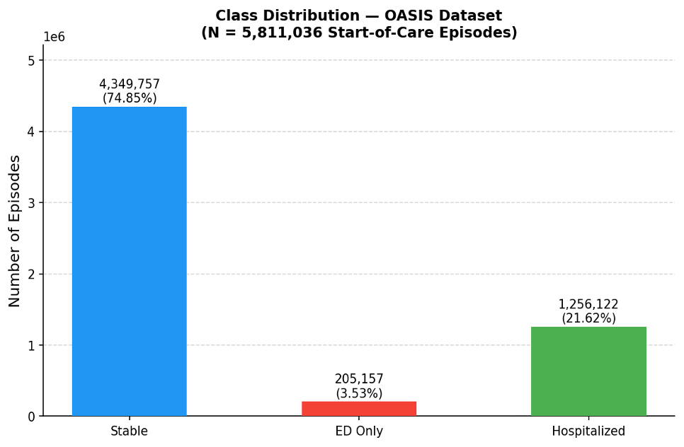

### Task 1 Cohort

Includes SDOH augmentation and comorbidity scores.

| Property | Value |
|---|---|
| Episodes | 5,488,376 |
| Features (pre-selection) | 539 |
| Features (post-selection) | 310 |
| Stable (0) | 81.6% |
| Hospitalized (1) | 18.4% |

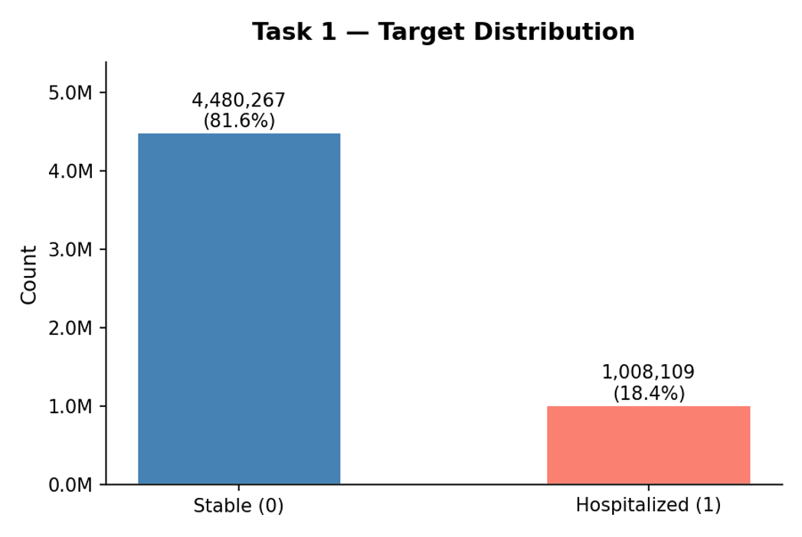

### Task 2 Cohort

Conditional on episodes where an ED visit occurred. Includes SDOH augmentation and comorbidity scores.

| Property | Value |
|---|---|
| Episodes | 926,703 |
| Features (pre-selection) | 621 |
| Features (post-selection) | 330 |
| Admitted (1) | 82.8% |
| Discharged home (0) | 17.2% |

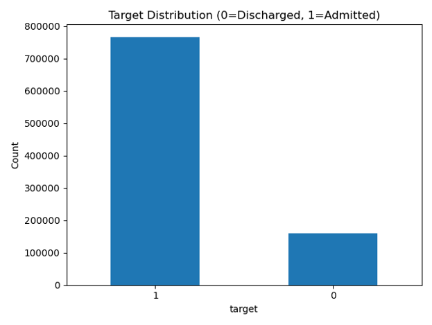

---

## 3. Exploratory Data Analysis

### Multiclass EDA

Feature correlations with the ED-only class were examined to understand predictive signal availability. Results shown below are from the raw dataset before any preprocessing.

| Feature | Correlation with ED-Only |
|---|---|
| Inpatient_Facility_Admitted | 0.54 |
| Emergent_Care_Reason_Injury_Caused_By_Fall | 0.10 |
| Emergent_Care_Reason_Uncontrolled_Pain | 0.09 |
| Heart_failure_follow_up_change_in_care_plan | 0.07 |
| Current_Grooming | 0.07 |
| Heart_failure_follow_up_ER_treatment_advised | 0.07 |
| When_Anxious | 0.06 |

The strongest correlate (r = 0.54) is a post-episode outcome column — not a usable feature. The remaining non-leakage correlations max at r = 0.10, compared to r = 0.25 for the hospitalization target. The ED-only class has substantially weaker signal in OASIS intake features, which is the core reason the three-class formulation was eventually abandoned.

### Task 1 EDA

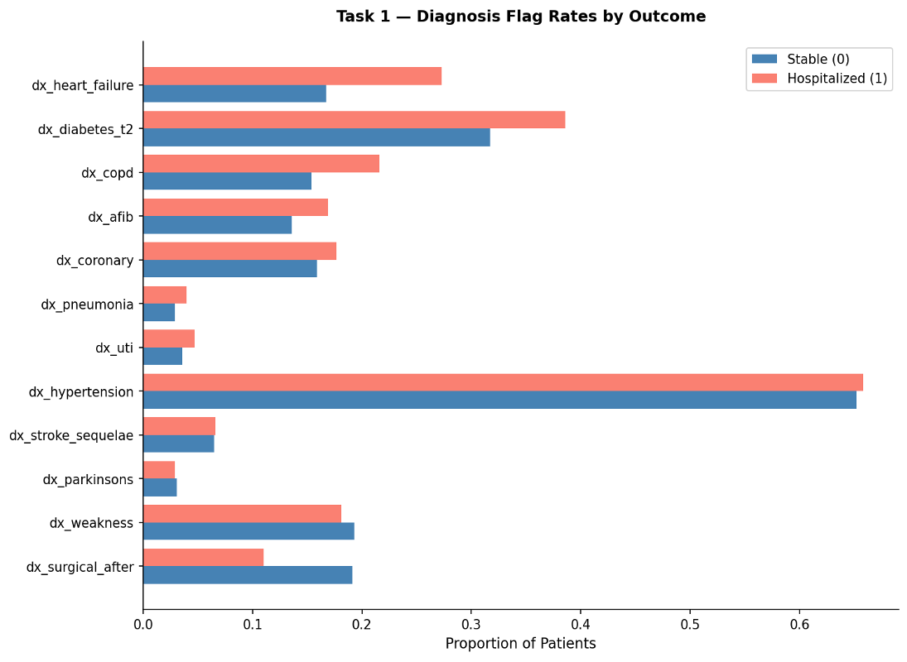

Cardiovascular and metabolic conditions are consistently elevated among hospitalized patients. Heart failure: 27% hospitalized vs 17% stable. COPD: 21% vs 15%. Hypertension is near-universal in both classes (~65%) and has low discriminatory power despite high prevalence.

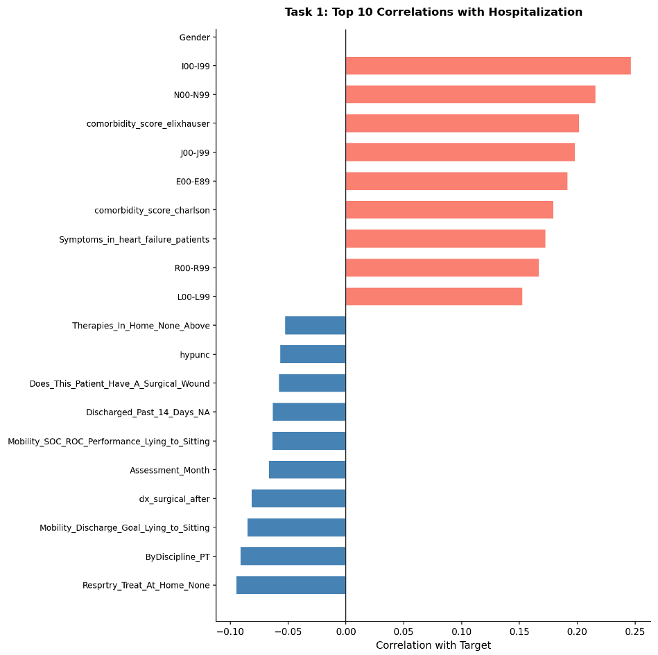

Circulatory ICD chapter (I00-I99) shows the strongest positive correlation (r ≈ 0.25), followed by renal (N00-N99), Elixhauser comorbidity score, and respiratory (J00-J99). Negative correlates include physical therapy discipline, surgical wound presence, and mobility discharge goals — reflecting a post-surgical patient population with lower baseline acuity.

### Task 2 EDA

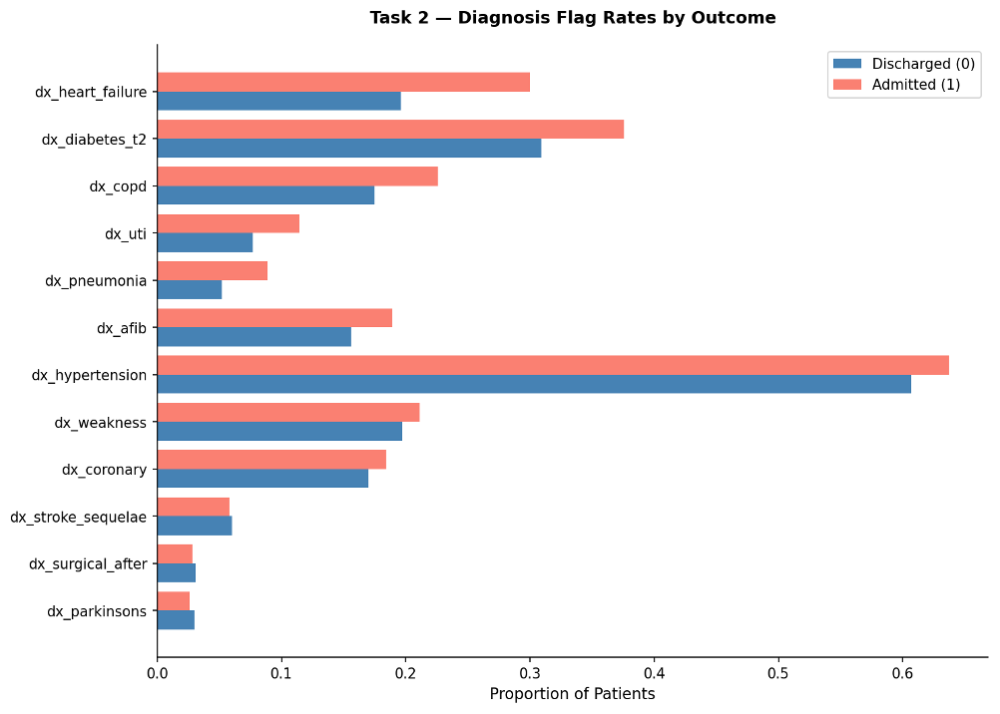

Admitted patients show higher rates of heart failure (30% vs 20%), COPD (22% vs 18%), and atrial fibrillation (19% vs 15%). The pattern mirrors Task 1, reflecting the shared OASIS clinical population.

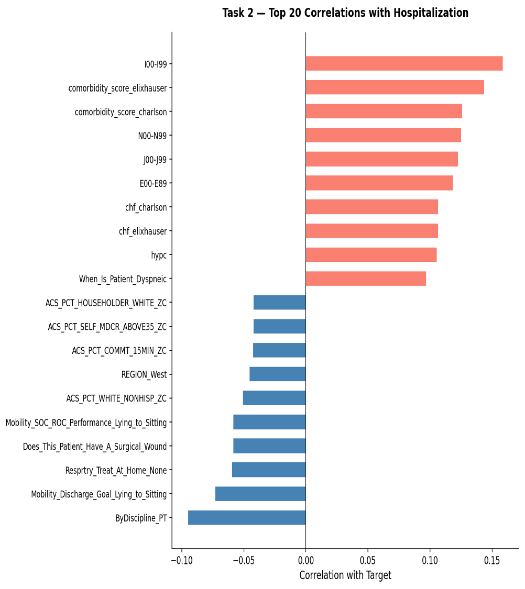

Circulatory ICD chapter (I00-I99) is again the top correlate (r ≈ 0.16), followed by Elixhauser and Charlson comorbidity scores, and respiratory/endocrine chapters. SDOH variables (ACS percent white householder, percent Medicare above 35%) appear as negative correlates — reflecting geographic patterns in ED utilization rather than individual clinical risk.

---

## 4. Data Preprocessing

### Multiclass Preprocessing

- Filtered to SOC assessments only — 15,754,330 → 5,811,036 rows
- Excluded 100% missing columns
- Retained columns with <95% missingness
- Dropped identifier, billing, payment, and date columns
- Reserved 41 outcome columns for target construction only, then dropped
- Consolidated high-cardinality ICD text columns into 22 binary chapter flags
- **300 raw features → 98 final features**

**Target construction — higher acuity takes priority:**

```
Any Hospital_Reason_* filled      → Class 2 (Hospitalized)
Any Emergent_Care_Reason_* filled  → Class 1 (ED Only)
Neither                            → Class 0 (Stable)
```

Split: 70/15/15 stratified by target. Primary metric: Macro F1.

---

### Task 1 & Task 2 Preprocessing (Shared Pipeline)

#### Episode Construction

Raw OASIS contains multiple row types per episode. Hospitalization and ED labels live on NaN `Patient_Overall_Status` rows. Clinical features live on coded rows (00/01/02/03). A standard first-row filter would grab coded rows — always stable — producing a broken 1.8% positive rate instead of the true 18.4%.

Correct approach:
1. Extract SOC-row features per episode from coded rows
2. Scan all rows in the episode for outcome flags
3. Join label back to the SOC feature row

#### Surface Cleaning

- ZIP cleanup: standardized ZIP+4 to 5-digit, dropped 3 junk rows
- SDOH merge: inner join on 5-digit ZIP — 394 rows lost (0.03%)
- ICD codes melted to long format: 6 diagnosis columns per row
- Comorbidity scores computed at episode level: Charlson (17 conditions), Elixhauser (31 conditions), HFRS (frailty)
- Dropped 99%+ null columns, payment columns, identifier columns
- **Result: 15,692,563 × 640**

#### Task 1 Specific Steps

- Filtered to 2017+ SOC episodes → 5,488,376 episodes
- Dropped identifier, leakage, and post-episode temporal columns
- Extracted Assessment_Month, dropped raw date columns
- Dropped columns with >90% nulls
- ICD text → 12 binary chapter flags
- Engineered BMI from Height/Weight
- Dropped zero-variance and sparse mid-episode columns
- Encoded ordinal, binary, and categorical features
- MNAR imputation: wound/ulcer columns → 0 (condition absent)
- **Final: 5,488,376 × 540**

#### Task 2 Specific Steps

- Labels constructed at episode level: ED visit occurrence identified the eligible cohort; hospitalization outcome defined the binary target
- Filtered to 2017+ ED-presenting episodes → 926,703 episodes
- Retained only the SOC assessment as the feature snapshot per episode
- Removed outcome leakage: ED reason columns, hospitalization reason columns, discharge disposition
- Extended leakage audit identified additional leaks: proxy missingness patterns, encoded outcome variables, post-episode temporal columns
- Prior utilization columns confirmed SOC-available and retained
- Wound columns imputed with 0 (condition absent); sparse SDOH subgroup column dropped
- Encoded ordinal, binary, and categorical features
- **Final: 926,703 × 588**

#### Missing Data Strategy

OASIS uses multiple representations of missing: NaN, `'UK'`, `'-'`, `88` (activity did not occur), `9` (unknown). All sentinel values cleaned to NaN before encoding to avoid false ordinal meaning.

| Missingness Type | Strategy | Reason |
|---|---|---|
| MNAR — clinical condition columns | Impute with 0 | Missing = condition absent |
| >99% missing | Drop at variance threshold | No useful signal |
| Mean/median imputation | Not used | Destroys valid clinical signal |

---

## 5. Feature Selection

### Multiclass

Feature selection was not applied to the multiclass model. Tree-based models — LightGBM, XGBoost — handle feature interactions and importance through recursive splitting. Manual selection is redundant and can introduce noise by removing features that only contribute in combination with others. The original 98 SOC features were used as-is following preprocessing.

### Task 1 & Task 2

The same three-stage pipeline was applied to both tasks before any train/test split.

**Stage 1 — Variance Threshold:** Dropped columns where >99% of rows had the same value. Targets: broken comorbidity sub-flags, rare ICD chapters, empty territory columns.

**Stage 2 — Correlation Filter:** Dropped features with r > 0.95 between each other. Targets: redundant ACS population count slices (e.g., percent urban and percent rural sum to 100%).

**Stage 3 — Target Correlation Filter:** Dropped features with |r| < 0.01 with the target — no discriminatory signal for either class.

| Stage | Task 1 | Task 2 |
|---|---|---|
| Starting features | 539 | 621 |
| After variance threshold | 506 | 553 |
| After correlation filter | 435 | 482 |
| After target correlation filter | **310** | **330** |

**AIAN note:** `ACS_MEDIAN_HH_INC_AIAN_ZC` retained in Task 1 despite 76% missingness — the sparsity reflects population distribution, not data quality. Dropped in Task 2 v1, retained in v2.

**Comorbidity scores note:** Composite scores (Charlson, Elixhauser, HFRS) dropped in Task 2 v2. AUC difference vs individual flags: 0.0005. Individual condition flags capture the same signal.

---

## 6. Modeling

### Split

**Multiclass:** 70/15/15 stratified by target class. Primary metric: Macro F1.

| Split | Rows | Stable % | ED % | Hosp % |
|---|---|---|---|---|
| Train | 4,067,725 | 74.9% | 3.5% | 21.6% |
| Val | 871,655 | 74.9% | 3.5% | 21.6% |
| Test | 871,656 | 74.9% | 3.5% | 21.6% |

**Task 1 & Task 2:** 80/10/10 stratified split, `random_state=42`. Test set held out, not used during development, hyperparameter tuning, or threshold selection.

**Task 1:**

| Split | Rows | Hospitalized % |
|---|---|---|
| Train | 4,390,700 | 18.4% |
| Val | 548,838 | 18.4% |
| Test | 548,838 | 18.4% |

**Task 2:**

| Split | Rows | Admitted % |
|---|---|---|
| Train | 741,362 | 82.8% |
| Val | 92,670 | 82.8% |
| Test | 92,671 | 82.8% |

---

### Multiclass Modeling

**Class Imbalance Strategies:**

| Strategy | ED F1 | Macro F1 | Notes |
|---|---|---|---|
| No handling | 0.000 | ~0.64 | Model ignores ED entirely |
| `class_weight='balanced'` | 0.163 | **0.675** | Best overall — selected |
| `is_unbalance=True` | 0.000 | ~0.64 | LightGBM internal flag, no improvement |
| Full SMOTE | 0.056 | — | Worse than class weights |
| Targeted SMOTE (100K ED) | 0.001 | — | Synthetic patients diverged from real distribution |
| Undersampling 10:1 | 0.126 | 0.607 | Hurt Stable and Hospitalized F1 |
| Undersampling 1:1 | 0.138 | 0.629 | — |

**Baseline Models (class_weight='balanced'):**

| Model | Macro F1 | Stable F1 | ED F1 | Hosp F1 |
|---|---|---|---|---|
| Random Forest | 0.675 | 0.899 | 0.163 | 0.964 |
| XGBoost | 0.643 | 0.818 | 0.147 | 0.964 |
| LightGBM | 0.641 | 0.813 | 0.144 | 0.964 |

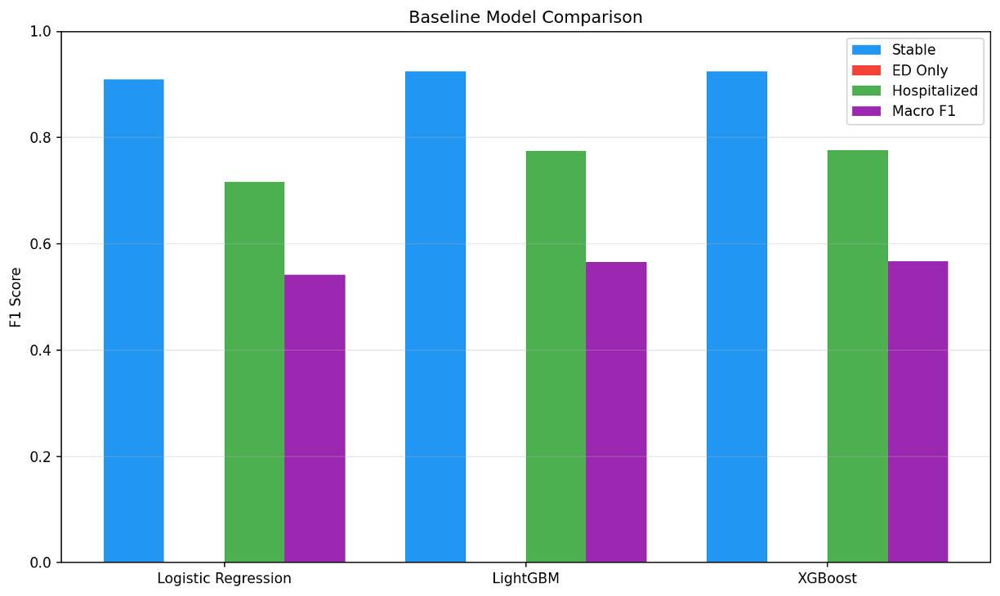

**Hyperparameter Tuning:**

| Method | Macro F1 | Notes |
|---|---|---|
| RandomizedSearch | ~0.57 | Broad search, fast |
| GridSearch | **0.581** | Narrower, exhaustive — selected |
| Optuna | ~0.57 | Bayesian, efficient |

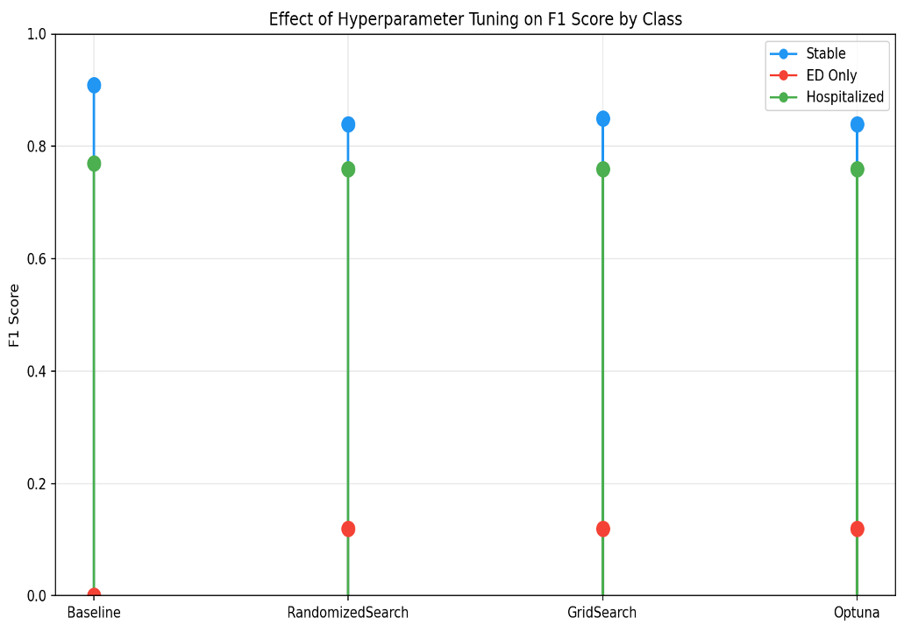

**Deep Learning:**

| Model | Macro F1 | Notes |
|---|---|---|
| MLP (no scaling) | ~0.55 | Sensitive to unscaled features |
| MLP + StandardScaler | ~0.56 | Improved but below LightGBM |
| MLP + Scaling + Weights | ~0.57 | Best MLP variant |
| TabNet | ~0.57 | Attention-based, did not beat tuned trees |

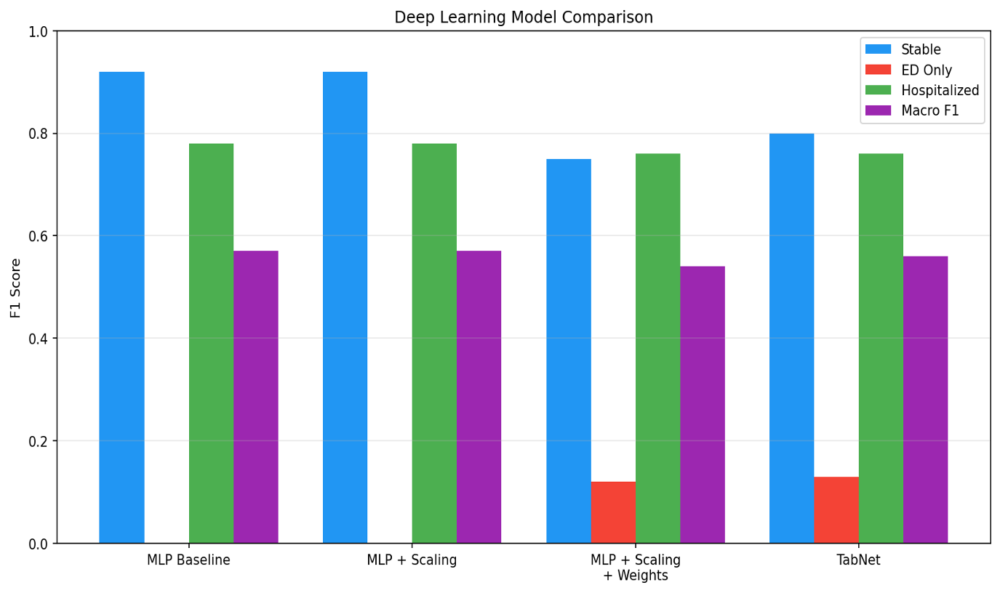

**One-vs-Rest (OvR):**

Trained 3 separate binary classifiers: Stable vs Rest, ED vs Rest, Hospitalized vs Rest.

| Result | Value |
|---|---|
| ED recall | 0.56 — strongest ED recall across all experiments |
| Overall Macro F1 | 0.510 — lower than standard multiclass |

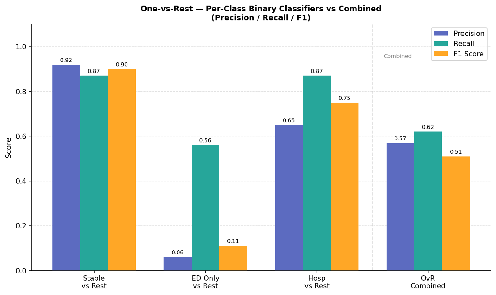

OvR improved ED recall substantially but at the cost of overall Macro F1. Not selected as final model.

**Final Multiclass Model: LightGBM GridSearch:**

```
n_estimators:      1100
num_leaves:        270
learning_rate:     0.15
min_child_samples: 161
subsample:         0.55
colsample_bytree:  0.86
class_weight:      balanced
```

**SHAP Analysis:**

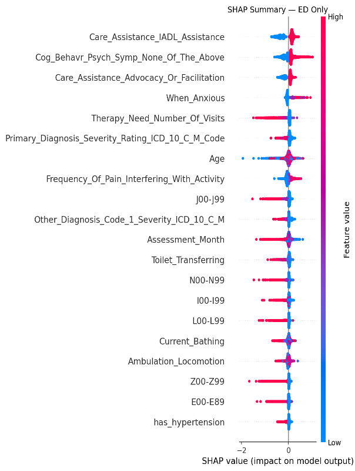

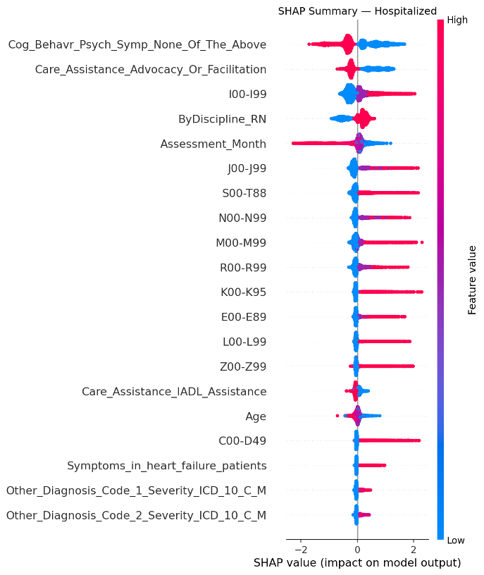

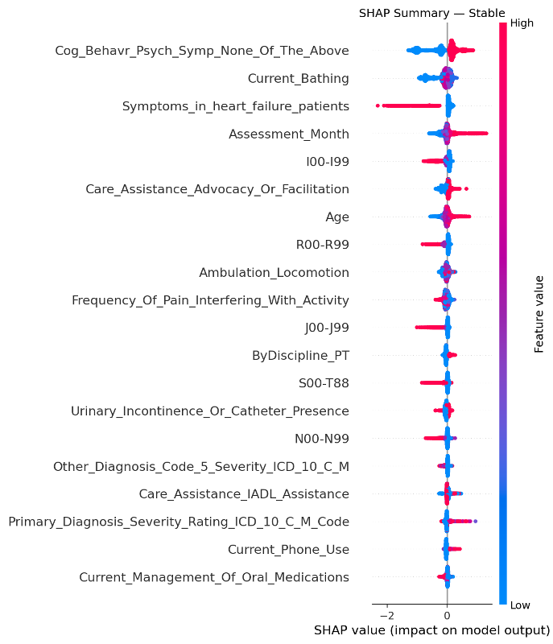

SHAP analysis confirmed that ED and hospitalization are driven by fundamentally different feature profiles. Hospitalization risk is dominated by circulatory and respiratory ICD chapters. ED-only risk is associated with functional dependence indicators and anxiety symptoms. This finding that the two outcomes have distinct feature profiles supports the clinical rationale for separating them into two binary tasks.

---

### Task 1 Modeling

**What was tried:**

| Model / Strategy | ROC-AUC | Notes |
|---|---|---|
| LightGBM baseline | 0.8791 | Default params |
| LightGBM + class_weight | 0.8793 | Improved recall |
| MLP (PyTorch) | 0.8372 | Did not beat trees |
| TabNet | 0.8374 | Did not beat trees |
| TabPFN v2.6 | 0.8619 | 10K sample only — not scalable |
| LightGBM RandomizedSearch | 0.8816 | Broader search |
| **LightGBM Optuna (75 trials × 5-fold)** | **0.8903** | **Selected** |

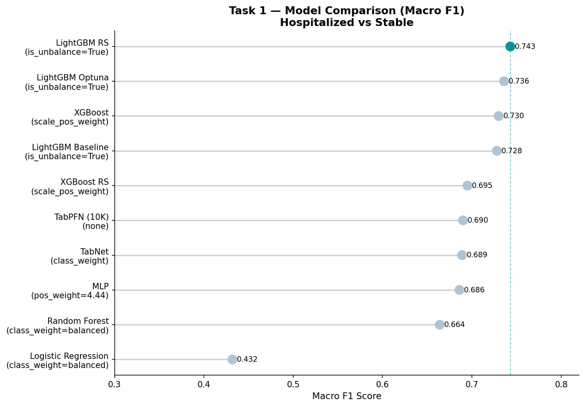

LightGBM Optuna selected as it showed highest ROC-AUC (0.890) and PR-AUC (0.694), more clinically meaningful for risk stratification than Macro F1 alone.

**Best Optuna Parameters:**

```
n_estimators:      784
num_leaves:        181
learning_rate:     0.107
min_child_samples: 167
subsample:         0.491
colsample_bytree:  0.972
reg_alpha:         0.498
reg_lambda:        0.004
```

Tuning ran on LEAP2 himem-001, 48 CPUs, ~913 minutes.

**SHAP Analysis (Task 1):**

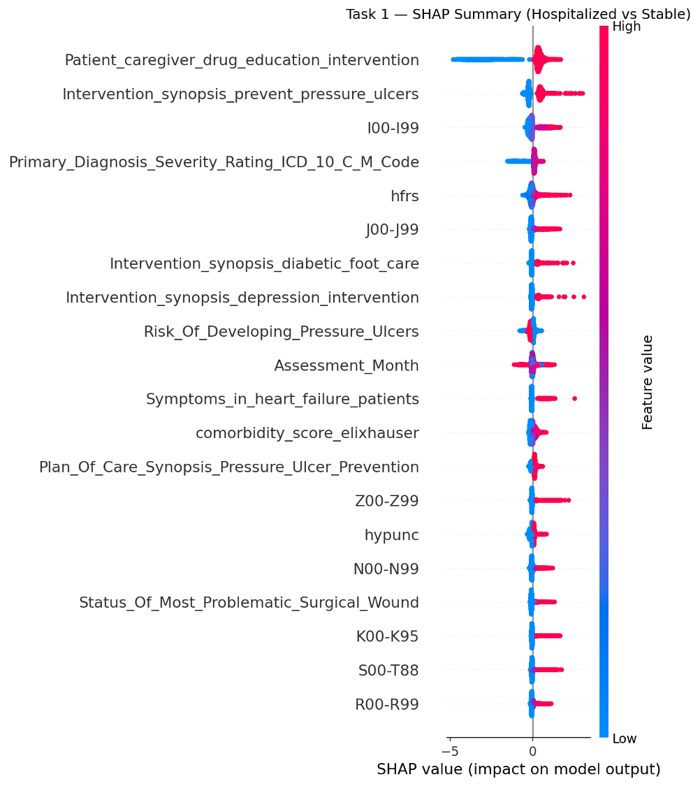

Top positive drivers: I00-I99 (circulatory), N00-N99 (renal), comorbidity burden scores, J00-J99 (respiratory). Top negative drivers: PT discipline, surgical wound present, high mobility at discharge goal, lower acuity post-surgical patients.

---

### Task 2 Modeling

**What was tried:**

| Model / Strategy | ROC-AUC | Macro F1 | Notes |
|---|---|---|---|
| Logistic Regression | 0.5568 | 0.45 | Failed minority class entirely |
| Random Forest | — | — | Class 0 recall < 0.11 |
| LightGBM baseline | ~0.80 | — | — |
| Undersampling | — | — | Hurt Class 0 recall significantly |
| LightGBM Optuna | 0.8252 | — | Best before feature selection |
| LightGBM Optuna (330 feat) | 0.7989 | 0.683 | Small AUC drop, cleaner model |
| **+ threshold = 0.70** | **0.7989** | **0.700** | **Selected** |

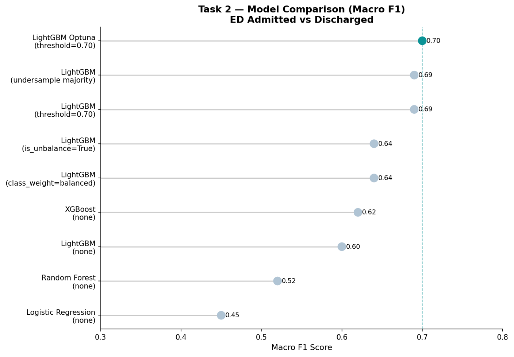

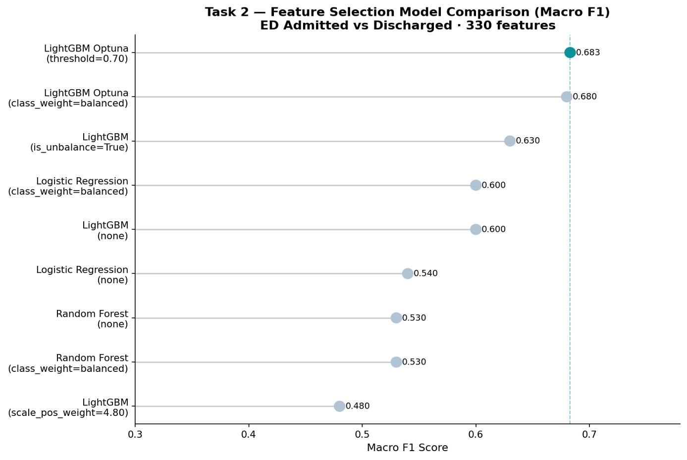

**SDOH Ablation:**

| Feature Set | Features | ROC-AUC | Macro F1 |
|---|---|---|---|
| Combined (Clinical + SDOH) | 330 | 0.7989 | 0.683 |
| Clinical Only | 168 | 0.7969 | 0.680 |
| SDOH Only | 162 | 0.5977 | 0.544 |

SDOH alone performs near-random. Adding SDOH to clinical features improves AUC by only 0.002. ZIP-level census data is too coarse to capture individual social risk. Clinical features carry the signal.

**SHAP Analysis (Task 2):**

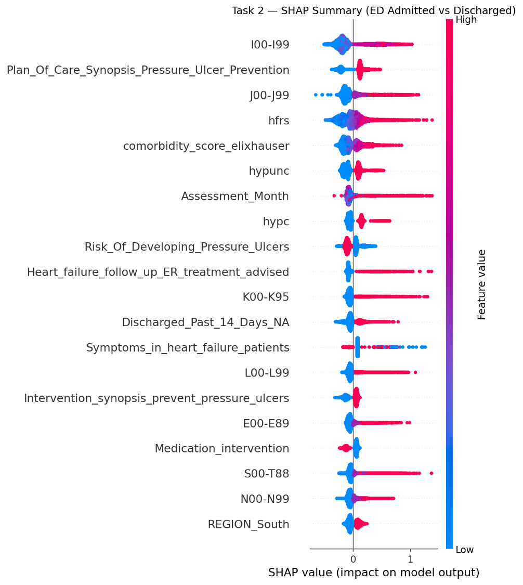

Top drivers: I00-I99 (circulatory), J00-J99 (respiratory), comorbidity burden, dyspnea symptoms. SDOH features appear low in SHAP rankings, consistent with the ablation finding.

---

## 7. Final Models and Results

### Multiclass — Validation Set

**Model:** LightGBM GridSearch, 98 features

| Class | Precision | Recall | F1 |
|---|---|---|---|
| Stable | 0.93 | 0.78 | 0.85 |
| ED Only | 0.08 | 0.24 | 0.12 |
| Hospitalized | 0.69 | 0.85 | 0.76 |
| **Macro avg** | — | — | **0.581** |

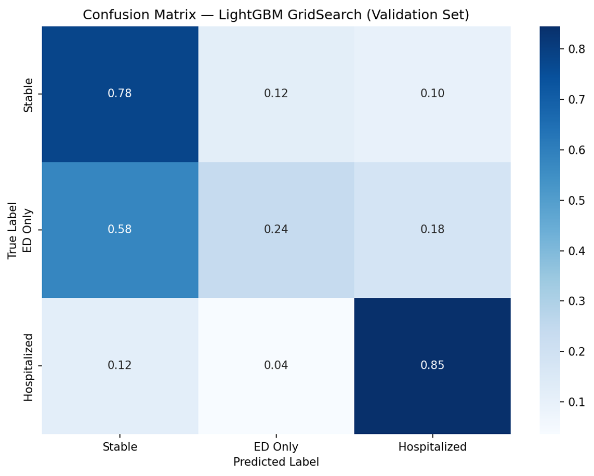

ED F1 = 0.12 held across every strategy. 58% of ED-only patients misclassified as Stable. The model detects 1 in 4 ED patients at best.

---

### Task 1 — Test Set

**Model:** LightGBM Optuna, 310 features, `class_weight='balanced'`

| Class | Precision | Recall | F1 | Support |
|---|---|---|---|---|
| Stable (0) | 0.95 | 0.80 | 0.86 | 448,027 |
| Hospitalized (1) | 0.47 | 0.80 | 0.59 | 100,811 |
| Macro avg | 0.71 | 0.80 | 0.73 | 548,838 |
| Weighted avg | 0.86 | 0.80 | 0.81 | 548,838 |

**ROC-AUC: 0.8838 | PR-AUC: 0.6768 | Macro F1: 0.7269**

Val → Test: 0.8903 → 0.8838. No overfitting.

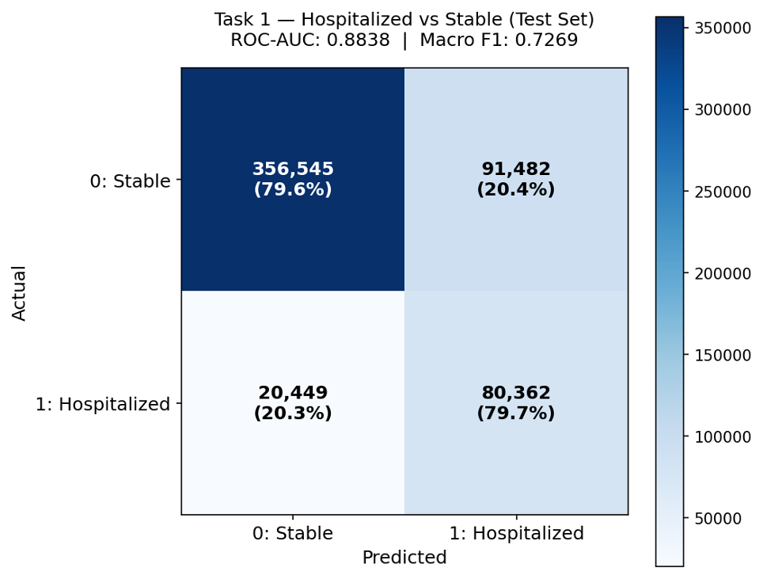

---

### Task 2 — Test Set

**Model:** LightGBM Optuna, 330 features, threshold = 0.70

| Metric | Value |
|---|---|
| ROC-AUC | 0.7967 |
| Macro F1 | 0.6437 |
| Discharged (0) correctly classified | 70.5% |
| Admitted (1) correctly classified | 73.2% |

Val → Test: 0.7989 → 0.7967. No overfitting.

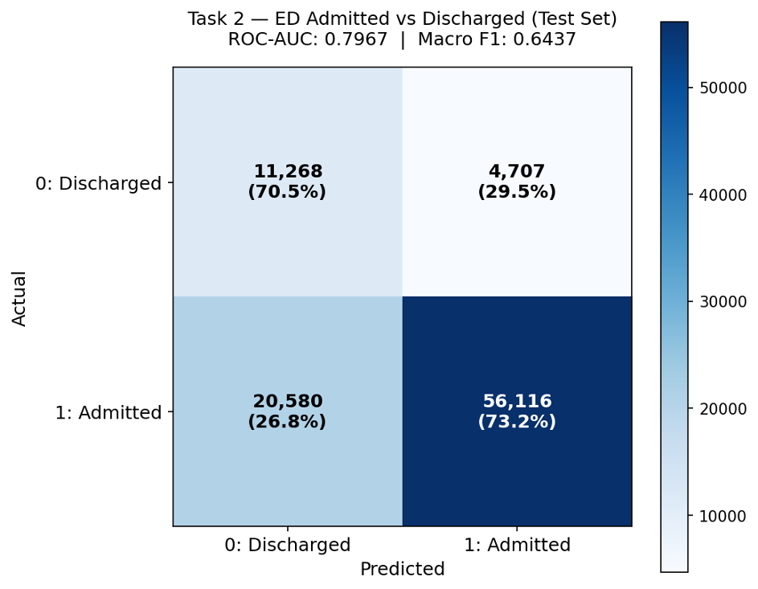

---

### Why Task 1 and Task 2 Are the Final Models

The three-class formulation was abandoned for the following reasons:

- ED-only at 3.5% of episodes is rare and weakly correlated with intake features to be reliably predicted
- No strategy including class weights, SMOTE, undersampling, threshold tuning, OvR, deep learning, produced ED F1 above 0.13
- The F1 ceiling: ED visits are driven by acute unpredictable events not captured at intake
- The two-task binary reformulation isolates each clinical question cleanly, enabling meaningful prediction where signal exists

Task 1 and Task 2 together answer the same clinical question as the multiclass model with substantially stronger performance on the outcomes.

---

## 8. Discussion

The three-class model established a ceiling for ED-only prediction. Across every strategy, class weights, SMOTE, undersampling, threshold tuning, OvR, deep learning, the ED-only class produced F1 = 0.12. SHAP analysis confirmed that ED visits and hospitalizations are driven by different feature profiles, validating the clinical rationale for separating them. However, the intake features captured in OASIS are too coarse for ED-only prediction specifically. ED visits in home health are dominated by acute, unpredictable events like falls, sudden pain crises, medication errors that leave little trace in a clinical assessment taken weeks earlier.

The two-task reformulation addressed this by asking two distinct clinical questions rather than one difficult three-way question. Task 1 — hospitalization vs stable — benefits from a cleaner signal: chronic disease burden, cardiovascular and respiratory comorbidities, and functional decline at intake are all meaningfully predictive of inpatient admission. Task 2 — ED admission vs discharge. The 0.80 AUC is meaningful discrimination but reflects that ceiling.

The SDOH finding is also meaningful as a negative result. ZIP-level census data contributes very little beyond clinical features — +0.002 AUC. This is not evidence that social determinants are unimportant clinically. It is evidence that area-level aggregates are too coarse to capture individual social risk. Patient-level SDOH documentation, if systematically collected in OASIS, would likely show stronger signal.

---

## 9. Key Findings

1. LightGBM outperforms deep learning on tabular clinical data.
2. SDOH census features add minimal predictive lift.
3. **Task 1 achieves clinically useful discrimination.** Precision of 0.47 on hospitalized against a base rate of 18.4% a 2.5x lift. 80% recall means 4 in 5 eventual hospitalizations are flagged at intake.
4. **Feature selection improved Task 1.** 540 → 310 features improved Macro F1 from 0.736 to 0.760 while maintaining ROC-AUC. Removing noise from weak features improved decision boundaries.

---

## 10. Future Work

- FT-Transformer: tabular transformer architecture, competitive with gradient boosting on EHR data
- Fairness analysis: performance across race, income, and geographic subgroups
- Ensemble/stacking: combine LightGBM + XGBoost + MLP via meta-learner to improve precision
- Patient-level SDOH documentation as a more granular alternative to ZIP-level proxies
- Comorbidity score ablation: test dropping Charlson or Elixhauser (r = 0.73 between them) without performance loss

---

## 11. References & Links

### Data Sources
- Centers for Medicare & Medicaid Services (CMS). OASIS (Outcome and Assessment Information Set) Dataset. Home Health Care OASIS assessments, 2017.
- Agency for Healthcare Research and Quality (AHRQ). Social Determinants of Health Database. ZIP-code level ACS indicators, 2017 onward.

### Framework Reference
- CONNECT 2.0 Framework: https://github.com/MElizondo1121/Connect-2.0/

### Literature
1. Song J et al. Clinical notes: An untapped opportunity for improving risk prediction for hospitalization and ED visit during home health care. *J Biomed Inform.* 2022.
2. Topaz M et al. *Nurs Res.* 2020;69(6):448–454.
3. Chae S et al. Predicting ED visits and hospitalizations for patients with heart failure in home healthcare using a time series risk model. *J Am Med Inform Assoc.* 2023.
4. Park J et al. Factors associated with ED visits and consequent hospitalization and death in Korea. *Healthcare.* 2022;10(7):1324.
5. Nagurney JM et al. ED visits without hospitalization are associated with functional decline in older persons. *Ann Emerg Med.* 2017;69(4):426–433.
6. Grinsztajn L et al. Why tree-based models still outperform deep learning on tabular data. *NeurIPS.* 2022.

### Libraries Used
- Python 3.11
- scikit-learn — https://scikit-learn.org/stable/
- LightGBM — https://lightgbm.readthedocs.io/
- XGBoost — https://xgboost.readthedocs.io/
- Optuna — https://optuna.readthedocs.io/
- pandas — https://pandas.pydata.org/docs/
- numpy
- matplotlib
- seaborn
